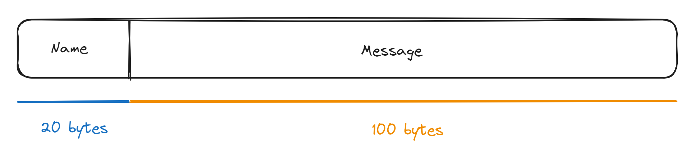

# ChatServer

A simple implementation of a server/client architecture to send and receive messages using sockets.
Start a server, connect the clients to it and enjoy.  
The interface is made using ncurses.

# Architecture

## Server

The server is a simple program that listens to incoming connections and handle all the clients using the `select` function.  
When a message is received, it sends it to all the connected clients.
If the message is **"exit"**, it sends back **"exit"** and closes the connection with this client.

## Client

The client receives and sends messages to the server. If the received message is **"exit"**, it closes the connection with the server.

## Packets

The communication between the server and the clients is done using fixed-size packets.
A packet is composed of a name and a message.
The name is the name of the client that sent the message.
We can see on the image the structure of a packet : 

I could improve this by adding a size field at the beginning of each part to reduce the size and also add a control field to create my own protocol in the end.

# Motivation

I wanted to improve my understanding of the socket in C and in general.
I also discovered ncurses during the project and I really liked it so I decided to build my interface with.

